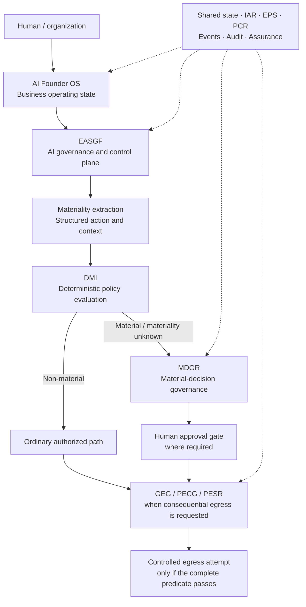

# AFGS v1.0 — Architecture overview

**Document class:** Source-derived explanatory companion.  
**Source:** Frozen specification §§2–4, 6–7 and 11.

## Jurisdiction, not a monolithic agent

This is an explanatory routing/dependency view, not a deployment diagram, an implemented state machine or a claim that EASGF applies only once. The source treats EASGF as the AI governance control plane and MDGR as a conditional material-decision runtime. A normal/non-material route is not a bypass of the controls required for consequential egress.

## State ownership

| State domain | Owner | Examples |
| --- | --- | --- |
| Business state | AI Founder OS | Objective, stage, capital posture, operating decision, KPI and portfolio state. |
| AI runtime state | EASGF | Source mode, active capabilities, authorized tools, context and validation state. |
| Material governance state | MDGR | Triage phase, binding findings, verdict, conditions and validity window. |
| Shared governance events | Shared substrate service | Policy changes, revocations, token consumption, overrides and appeals. |

A pillar may mutate only its own state. Cross-pillar effects travel through registered events and versioned references. A revoked permission does not erase the historical business decision; it changes effective execution eligibility. Source: §4.

## Shared governance services

| Service | Function in the source specification |
| --- | --- |
| Integration & State Services | State references, event routing, versioning and workstream isolation. |
| Identity & Authority Registry (IAR) | Authenticated roles, delegated limits, separation of duties, vetoes and expiry. |
| Evidence & Provenance Service (EPS) | Evidence identity, integrity, version, freshness, authority and derivation. |
| Policy & Constraint Registry (PCR) | Versioned constraints, including controls requiring human interpretation. |
| Governed Execution Gateway (GEG) | Deployment-controlled egress boundary for consequential external actions. |
| Audit / Observability / Assurance | Event history, decision trace and conformance/review evidence. |

Source: §3.1. Infrastructure implementation is not included in this repository.

## Reasoning and control

Under §7, probabilistic components may discover failures and propose findings. Machine-evaluable binding constraints require deterministic external validation; interpretation-required constraints require authenticated, jurisdiction-valid human authority or another explicitly authorized non-self-validating control. Multiple model personas do not create organizational authority.

See [execution semantics](execution-semantics.md), [invariants](../specification/invariants.md) and [technical source excerpts](../provenance/AFGS-v1.0-source-excerpts.txt).
